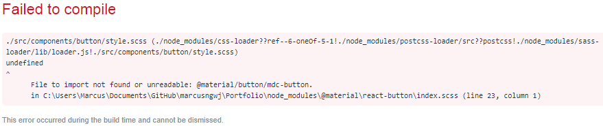

# Welcome to my Portfolio!

Thank you for visiting. However, I regret to say that the website currently undergoing construction. Do visit again!

# How this project was built

This project was bootstrapped with [Create React App](https://github.com/facebook/create-react-app).

## UI

#### SASS

`npm install node-sass --save` 
Change all existing .css file to .scss

- [Mixins](https://scotch.io/tutorials/how-to-use-sass-mixins)

#### Google Material UI via [MDC React](https://github.com/material-components/material-components-web-react)

Set SASS_PATH environment variable that points to node_module directory 
`SET SASS_PATH=.\node_modules`

If the following error occurred, please reset the `SASS_PATH`: 
 

- [Components Catalog](https://material-components.github.io/material-components-web-catalog/#/)
- [Material Icons](https://github.com/material-components/material-components-web-react/tree/master/packages/material-icon)
- [Color Tool](https://material.io/tools/color/#!/?view.left=0&view.right=0)

# Deployment

In the project directory, you can run:

#### `npm start`

Runs the app in the development mode. 
Open [http://localhost:3000](http://localhost:3000) to view it in the browser.

#### `npm test`

Launches the test runner in the interactive watch mode. 
See the section about [running tests](https://facebook.github.io/create-react-app/docs/running-tests) for more information.

#### `npm run build`

Builds the app for production to the `build` folder. 
It correctly bundles React in production mode and optimizes the build for the best performance. The build is minified and the filenames include the hashes.  See the section about [deployment](https://facebook.github.io/create-react-app/docs/deployment) for more information.
